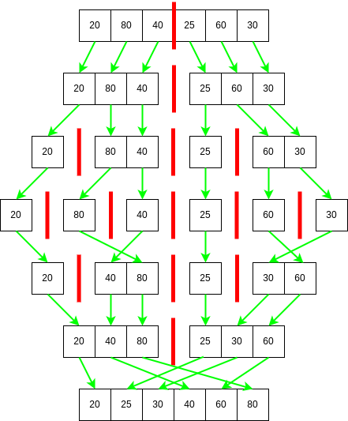
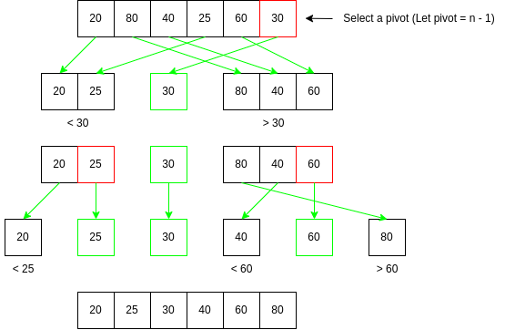

# Sorting Algorithms and Efficiency

## Comparisons

Time complexity (produced from algos/main.cpp):

| Algorithm  | Length | Pass1 | Pass2 | Pass3 | Avg Accesses |
|------------|--------|-------|-------|-------|-------------|
| **Bubble**  | 8      | 96    | 134   | 158   | 129         |
| **Bubble**  | 32     | 3112  | 2588  | 2570  | 2756        |
| **Bubble**  | 128    | 45272 | 47558 | 47206 | 46678       |
| **Selection** | 8      | 80    | 76    | 76    | 77          |
| **Selection** | 32     | 1104  | 1096  | 1100  | 1100        |
| **Selection** | 128    | 16732 | 16744 | 16728 | 16734       |
| **Insertion** | 8      | 44    | 73    | 58    | 58          |
| **Insertion** | 32     | 746   | 727   | 664   | 712         |
| **Insertion** | 128    | 11667 | 13498 | 12879 | 12681       |
| **Counting**  | 8      | 16    | 16    | 16    | 16          |
| **Counting**  | 32     | 64    | 64    | 64    | 64          |
| **Counting**  | 128    | 256   | 256   | 256   | 256         |
| **Merge**     | 8      | 82    | 82    | 78    | 80          |
| **Merge**     | 32     | 562   | 570   | 566   | 566         |
| **Merge**     | 128    | 3286  | 3226  | 3248  | 3253        |
| **Quick**     | 8      | 144   | 164   | 174   | 160         |
| **Quick**     | 32     | 752   | 780   | 790   | 774         |
| **Quick**     | 128    | 3340  | 3364  | 3416  | 3373        |

## Bubble Sort

## Selection Sort

## Insertion Sort

## Merge Sort

## Quick Sort

