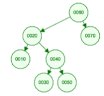
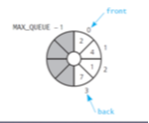

# Algorithms Practice

1. True/False: Command remove(5) is issued.  After this, the element previously at position 7 is guaranteed to be at position 6.

False, removing element at index 5 does not necessarily shift elements.

2. True/False: insertSorted(100) will always insert 100 at the end of the list.

False, it will insert at the end if 100 is the biggest element, otherwise 100 will be placed in sorted order

3. You have an array of n unsorted integers.  In big-O notation, what's the worst case efficiency of using insertSorted() to insert them all into a sorted list?  Assume the sorted list is implemented using a link-based approach.

`sum(1 + 2 + ... + (n-1)) = (n *(n - 1)) / 2 = O(n^2)`

4. True/False: a stack is a FIFO (first in first out) system

False, stack is LIFO (last in first out)

5. You have an algorithm which processes a string containing an algebraic expression.  Every time it sees open parenthesis ‘(‘ it pushes it on a stack.  Every time it sees close parenthesis ‘)’ it pops one element off the stack.  You process an expression using this algorithm and each push and pop operation returns true (success).  How would you test if the expression has balanced parenthesis?

Add to stack on open bracket and pop from stack on close bracket.

6. Assume you have a stack implemented which supports the following operations discussed in the videos and the textbook:

``` c++
+isEmpty(): boolean
+push(newEntry: ItemType): boolean                  
+pop(): boolean
+peek(): ItemType
```

What would peek() return after using push() to add these three items to it in order: 2 4 3?

``` c++
stk.push(2);
stk.push(4);
stk.push(3);
stk.peek();
3
```

7. True/False: a queue is a FIFO (first in first out) system

True

8. You've implemented a queue for a concierge phone line for customers of a Las Vegas casino in which customers are served in the order they called in.  Your boss tells you that customers with higher VIP status levels should be served before customers of lower VIP status levels.  What ADT could you use to accomplish this?

Priority Queue

9. You enqueue the following items into a queue of integers: 5 2 3.  What will peekFront() return?

5

10. True/False: each node in a binary tree has exactly two children.

False

11. What is the efficiency of traversal of a binary tree in big-O notation?  A binary search tree?

`O(n)`

12. True/false: the following tree is a balanced binary search tree.  



True

13. What's the minimum height of a binary tree with n nodes?

`height = log_2(n)`

14. If I add the element 45 to this binary search tree, where could it go?  Make sure to specify if it is a right or left child of its parent.


Element 45 is the right child of 0030.


15. Suppose I have an array-based queue which is implemented with a circular array in the state depicted below.  Illustrate the circular array after the following two operations:

``` c++
enqueue(9)
dequeue()
```



16. Write a C++ function sum() which returns the sum of all entries in a node-based binary search tree containing integers.  You may assume each node contains a valid integer.  You can assume the BinaryNode class supports the BinaryNode member functions discussed in class and the textbook: getItem(), getLeftChildPtr(), getRightChildPtr().

``` c++
// nodePtr: pointer to the root of the tree we want to sum
int sum(BinaryNode* nodePtr)
{
    if (nodePtr == nullptr)
        {return 0;}

    return nodePtr->getItem() + 
           sum(nodePtr->getLeftChildPtr()) + 
           sum(nodePtr->getRightChildPtr());
}
```

17. Write a pseudocode function sumPositive() which adds up all of the positive elements in a queue containing integers.

``` c++
sumPositive(aQueue: Queue): integer
```

For example, if aQueue contains, from front to back: 2, -3, 4, -10, 1

your function should return 7.  It is acceptable if you modify aQueue in the function.

You can assume that the queue supports only these functions:

``` c++
isEmpty(): boolean
enqueue(newEntry: integer): boolean 
dequeue(): boolean
peekFront(): integer
```

``` c++
sumPositive(aQueue: Queue): integer
    sum = 0
    size = 0

    // Step 1: Determine original size of the queue
    tempQueue = new Queue()

    while not aQueue.isEmpty()
        element = aQueue.peekFront()
        aQueue.dequeue()
        tempQueue.enqueue(element)
        size = size + 1

    // Step 2: Process elements and compute sum of positives
    for i from 1 to size
        element = tempQueue.peekFront()
        tempQueue.dequeue()
        
        if element > 0
            sum = sum + element
        
        // Re-enqueue back into aQueue if queue must be preserved
        aQueue.enqueue(element)

    return sum
```
