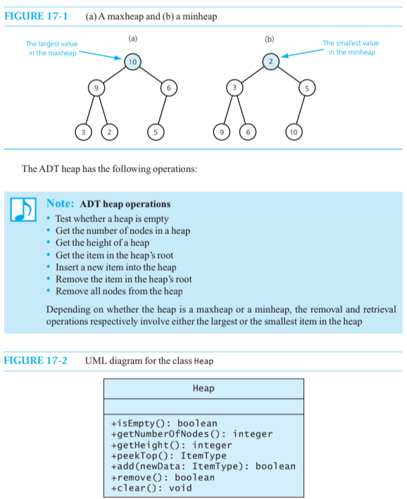
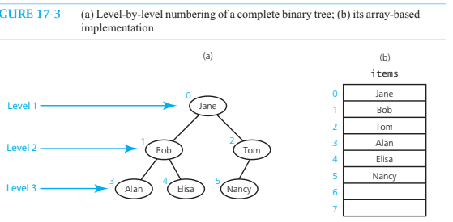
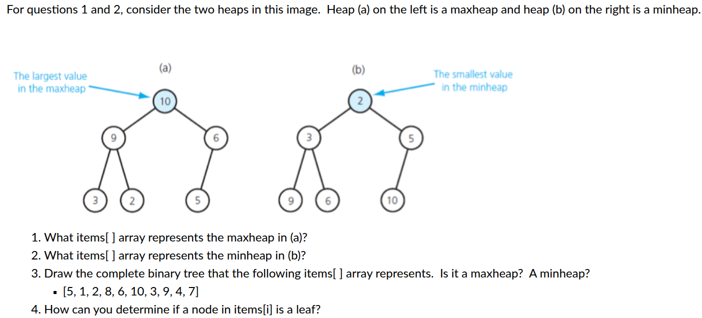

# Heaps

Always complete binary trees



## In an array based implementation of the Heap ADT



Given any node items[i], you can easily locate both of its children and its parent:

- Its left child, if it exists, is items[2 * i + 1]
- Its right child, if it exists, is items[2 * i + 2]
- Its parent, if it exists, is items[(i - 1) / 2]

## Questions



1. items[] = {10, 9, 6, 3, 2, 5}
2. items[] = {2, 3, 5, 9, 6, 10}
3. This tree is neither a maxheap nor minheap, it violates the conditions for both.

``` c++
          5
       /     \
     1        2
   /    \    /  \
  8      6  10   3
 / \    /
9   4  7
```

4. A node at index `i` is a **leaf** if `2 * i + 1 >= n`
